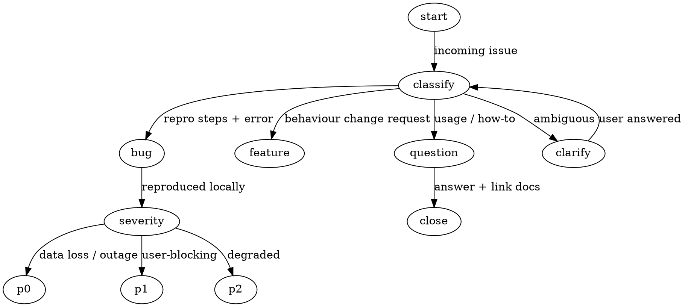

# 类别 1：结构脚手架

技能提示词的组织方式 — 支撑整体的骨架。

**相关基础技术：** Schema Priming, XML Tags for Semantic Boundaries（见 [prompt-engineering-for-skills.md](/prompt-context-patterns/catalog/techniques/token-level-techniques)）

---

## Pattern 1: YAML Frontmatter Metadata Block

**出现频率：** ~100% 的技能（2,290+ 文件）
**相关模式：** [Activation Scope](/prompt-context-patterns/catalog/categories/patterns-safety-and-trust-zh#pattern-13-activation-scope-when-to-use--when-not-to-use), [Tool Routing Tables](/prompt-context-patterns/catalog/categories/patterns-agent-orchestration-zh#pattern-21-tool-routing-tables)

**定义：** 每个 SKILL.md 顶部的结构化 YAML 块，声明技能的身份、触发条件、工具权限、参数，以及（高级场景中）输入/输出 schema。Frontmatter 由平台解析，而非 LLM — 它在模型看到正文之前就控制了技能的能力边界。

**适用场景：**
- 每个技能都必须有 frontmatter — 它是入口点
- 用 `allowed-tools` 限制工具访问（最小权限）
- 用 `description` 告知平台何时激活此技能
- 为需要契约约束的复杂技能添加 `input_schema` / `output_schema`

### 正面示例
```yaml
---
name: specification-writing
description: "Use when writing a product spec, feature spec, API contract, agent task spec, or any other specification where a zero-question document is required. Encodes outcome-first methodology, acceptance criteria taxonomy, scope boundary protocol, executor context model, and ambiguity resolution framework."
version: "1.3.0"
type: "codex"
tags: ["Problem Shaping", "Execution"]
created: "2026-02-19"
valid_until: "2026-08-19"
derived_from: "shared/toolkits/skills/specification_writing.md"
tested_with: ["Claude Sonnet 4.6", "Claude Opus 4.6"]
license: "MIT"
capability_summary: "Produces a Zero-Question Specification where every assumption is surfaced, every ambiguity is resolved or explicitly marked TBD, every acceptance criterion is binary-testable, and every scope boundary names the adjacent capability it excludes."
input_schema:
  feature_or_capability: "string — what is being specified"
  spec_type: "enum[product_feature, api_contract, agent_task, process_workflow, infrastructure_migration, research_discovery]"
  outcome: "string — the desired user or business outcome"
  executor: "string — optional, who will build this"
  constraints: "string — optional, technical constraints, dependencies, timeline"
  prior_context: "string — optional, existing docs, prior specs, stakeholder decisions"
output_schema:
  outcome_definition: "What success looks like, with binary-testable criteria"
  scope: "In-scope items with explicit out-of-scope boundaries"
  acceptance_criteria: "Binary-testable criteria per requirement, tagged by confidence"
  dependencies: "External dependencies, blocking decisions, TBD items with owners"
  failure_conditions: "What happens when things go wrong, with mitigation strategies"
  assumption_registry: "Load-bearing assumptions with confidence annotations"
  zero_question_score: "Computed completeness score after Step 6 audit"
  self_critique: ">=3 genuine weaknesses in this specification"
---
```

**为何有效：** 每个字段都有明确目的。`description` 精确告知平台何时触发。`input_schema` 和 `output_schema` 创建契约 — 模型知道接收什么、必须产出什么。版本追踪、测试覆盖（`tested_with`）和过期时间（`valid_until`）支持运维健康度。Schema 字段使用类型化定义（`enum[...]`、`string — description`），兼作文档。

### 反面示例

```yaml
---
name: spec-writer
description: Writes specs
---

Write a specification for whatever the user asks about. Make it detailed and comprehensive.
```

**为何失败：** `description` 太模糊 — 平台无法区分此技能和其他写作技能，导致误触发。没有 input/output schema 意味着模型每次运行发明不同结构。没有版本、过期时间、测试记录 — 无法追踪回归。正文只是一句模糊指令，模型没有结构可循。

---

## Pattern 2: Phased/Stepped Execution Flow

**出现频率：** ~54% 的技能（1,245 文件）
**相关模式：** [Confirmation Gates](/prompt-context-patterns/catalog/categories/patterns-execution-control-zh#pattern-8-confirmation-gates--human-in-the-loop), [Progress Feedback](/prompt-context-patterns/catalog/categories/patterns-execution-control-zh#pattern-9-progress-feedback--status-reporting), [Workflow Mode Branching](/prompt-context-patterns/catalog/categories/patterns-structural-scaffolding-zh#pattern-3-workflow-mode-branching)

**定义：** 将技能拆分为编号的、顺序执行的阶段或步骤。每个阶段有明确目标、具体动作和定义好的输出。这是超出简单技能后最主流的结构模式。

**适用场景：**
- 任何有 3+ 个不同阶段的工作流
- 后续阶段依赖前序阶段输出时
- 每个阶段需要不同错误处理时
- 阶段之间需要人工检查点时

### 正面示例
```markdown
## Phase 0: Language Detection

**Goal**: Determine the project's primary language to route to the correct pipeline

**Actions**:
1. Invoke `detect-project-language` skill
2. Read `.analysis/detect_project_language/language_detection.json`
3. If `primaryLanguage == "csharp"` → proceed to **C# Pipeline**
4. If `primaryLanguage == "powershell"` → proceed to **PowerShell Pipeline**
5. If `primaryLanguage == "unknown"` → stop and report to user

---

## C# Phase 1: Discovery

**Goal**: Understand file(s) that need to be reviewed

**Actions**:
1. Create todo list with all C# phases
2. Find .cs files under the target folder or belonging to the project

---

## C# Phase 2: Understand Codebase Architectures

**Goal**: Determine if the project is an internal infrastructure service and generate architecture context

**Actions**:
1. Check if INPUT's directory contains **src/sources** — if yes, it is internal infrastructure code
2. Use `understand-codebase-architecture` skill to understand the high-level architecture
3. Write a `architecture_{INPUT}.md` file to `.analysis/architecture/`

---

## C# Phase 3: Taint Analysis

**Goal**: Analyze each file for taint analysis and write security reports in parallel

**Actions**:
1. Launch taint-analyzer agents in parallel based on number of files, up to 64 agents
```

**为何有效：** 每个阶段都有命名的 **Goal**（做什么）、编号的 **Actions**（怎么做）和清晰的转换逻辑（何时继续、何时停止）。Goal/Actions 分离意味着即使模型需要调整具体命令，也能理解意图。阶段编号创建了模型可引用的进度追踪器。

### 反面示例

```markdown
Analyze the code for security issues. First figure out what language it is, then look for
vulnerabilities. Check for taint analysis issues and also understand the architecture.
Write reports for everything you find. Make sure to be thorough and check all the files.
```

**为何失败：** 所有动作压缩在一个段落中，没有排序。模型无法判断依赖关系 — 架构理解在污点分析之前还是之后？语言检测失败时没有停止条件。"Be thorough" 不是可执行指令。每次运行会以不同顺序和不同深度执行步骤。

### Phase 1 作为强制研究阶段（mcp-builder / skill-creator）

在 Anthropic 的 `mcp-builder` 与 `skill-creator` skill 中反复出现一种特定变体：**Phase 1 专门用于穷尽式研究**，在 Phase 1 输出物存在之前不得开始任何实现。

```markdown
## Phase 1（强制研究 —— 还不写代码）

目标：产出 `research.md`，覆盖我们将触及的所有 API 表面。

动作：
1. 抓取上游协议文档（通读，不只读标题）。
2. 抓取目标语言的 SDK reference；读每一个用到的类型。
3. 抓取 2 个以上参考实现；记录分歧模式。
4. 写 `research.md`：
     - API 表面表（endpoint、参数、返回结构）
     - 鉴权流程
     - 速率限制与分页
     - 已知坑 + 错误语义

Phase 1 完成 当且仅当 `research.md` 存在 *且* 覆盖 Phase 2 计划需要的每一项。
若 Phase 2 需要 `research.md` 没有的东西，回到 Phase 1。
```

"还不写代码"的禁令与收尾回环（"回到 Phase 1"）是关键 —— 它们防止常见失败模式：模型写了 80% 的 MCP server，撞上未文档化的边角，然后无法不重启地恢复。

---

## Pattern 3: Workflow Mode Branching

**出现频率：** ~5% 的技能（100-150 文件）
**相关模式：** [Phased Execution](/prompt-context-patterns/catalog/categories/patterns-structural-scaffolding-zh#pattern-2-phasedstepped-execution-flow), [Intent Classification](/prompt-context-patterns/catalog/categories/patterns-agent-orchestration-zh#pattern-20-intent-classification--smart-routing), [$ARGUMENTS Pattern](/prompt-context-patterns/catalog/categories/patterns-structural-scaffolding-zh#pattern-4-arguments-variable-pattern)

**定义：** 在单个技能中定义多个执行模式，每个模式有不同的阶段流程、护栏和输出深度。模式基于用户角色、参数或上下文选择。

**适用场景：**
- 同一技能服务于不同受众（内部 vs 外部）
- 需要"快速"和"深入"模式时
- 不同角色需要不同护栏时（例如 OCE 有门控，合作伙伴无中断运行）

### 正面示例
```markdown
## Mode: Partner vs OCE

| | **Partner mode** (default) | **OCE mode** |
|---|---|---|
| **User** | Customer/partner team | Cosmic App Deployment OCE |
| **Phases** | 0 → 1 → 2(a,b,c,f Step 1, Step 4) → 4 → 8 | 0 → 1 → 2 → 3 → 4 → 4.5 → 5 → 6 → 7 → 8 |
| **Gates** | None — runs end-to-end uninterrupted | G1, G2, G3, G4 |
| **IncidentTracker correlation** | Mandatory — runs automatically | Mandatory — runs automatically |
| **Phase 4.5 (deep dive)** | Skipped | On demand |
| **Phase 5 (mitigations)** | Skipped (platform-internal) | Full |
| **Phase 6/7 (PRs/TSGs)** | Skipped | On demand |
| **Report content** | Partner-friendly: error summary, runbook links, customer actions only | Full: all buckets, platform analysis, code traces |
| **R8/R9 rules** | Disabled — no hypothesis prompts | Enabled |
```

**为何有效：** 对比表让模式差异一目了然。每个维度（阶段、门控、报告内容、规则激活）都为两种模式显式指定 — 对包含或排除什么没有歧义。默认模式已标记，模型在未指定模式时无需猜测。

### 反面示例

```markdown
If the user is a partner, make the output simpler and skip the technical details.
If the user is an OCE engineer, include everything. Use your judgment about what
to include based on who you think the user is.
```

**为何失败：** "Simpler" 和 "everything" 未定义。"Use your judgment" 造成不确定行为 — 每次运行会包含/排除不同部分。无法验证选择了哪个模式或正确的阶段是否执行了。模型必须推断用户角色而不是由声明决定。

---

## Pattern 4: $ARGUMENTS Variable Pattern

**出现频率：** ~7% 的技能（169 文件）
**相关模式：** [Configuration Persistence](/prompt-context-patterns/catalog/categories/patterns-input-output-contracts-zh#pattern-16-configuration-persistence--first-time-setup), [Intent Classification](/prompt-context-patterns/catalog/categories/patterns-agent-orchestration-zh#pattern-20-intent-classification--smart-routing)

**定义：** 使用平台注入的 `$ARGUMENTS` 占位符在调用时接收用户输入，然后解析其中的结构化数据、标志和选项。

**适用场景：**
- 技能接受命令行风格的参数时
- 需要标志切换行为时（例如 `--json`、`--force`）
- 技能需要内联传入目标（URL、文件路径、标识符）时

### 正面示例
```markdown
## Arguments
$ARGUMENTS

Parse the arguments. Also check for these flags:
- `--json` — generate structured JSON output (see Step 7.8)
- `--force` — force a full review, ignoring cache and skipping early returns
- `--api-only` — skip local repo detection, use ADO API for everything
```

**为何有效：** 标志名称枚举并带有明确效果说明。每个标志映射到技能中后续引用的特定行为变更（Step 7.8 用于 JSON 输出）。模型确切知道要在参数字符串中寻找什么以及每个标志的含义。

### 反面示例

```markdown
The user will provide some arguments. Parse them and figure out what they want.
Handle any options they might pass.
```

**为何失败：** 没有定义标志名称，模型会自行发明参数语法。"Figure out what they want" 是一个开放的自然语言理解任务，而非参数解析。解析后的标志与技能行为之间没有关联 — 即使模型正确解析了，也不知道该怎么做。

---

## Pattern 151: HARD-GATE Block Tag（HARD-GATE 阻断标签）

**出现率:** 多源（superpowers 中 3+ 处使用）：brainstorming、using-superpowers、executing-plans（标签名称不一：HARD-GATE、SUBAGENT-STOP、BLOCKING）
**相关模式:** [Negative Constraints](/prompt-context-patterns/catalog/categories/patterns-execution-control-zh#pattern-6-negative-constraints--prohibition-lists)、[Confirmation Gates](/prompt-context-patterns/catalog/categories/patterns-execution-control-zh#pattern-8-confirmation-gates--human-in-the-loop)、[Iron-Law Inviolable Rule Framing](/prompt-context-patterns/catalog/categories/patterns-execution-control-zh#pattern-145-iron-law-inviolable-rule-framing)

**它是什么:** 一个视觉上独特、全大写的标签（`HARD-GATE`、`SUBAGENT-STOP`、`BLOCKING`），包裹一条 Agent 在未满足条件前不得越过的规则。区别于 Pattern 6（关于*要否定什么*）—— 本模式是把单一规则提升至普通行文之上的*视觉标记*。

### 正面示例

```markdown
<HARD-GATE>
在调用任何会写盘的工具之前，你 MUST 至少满足以下其一：
  (a) 本轮内用户的显式批准，OR
  (b) 已经触发的 confirmation gate

若两者都不满足：停。把拟写出作为计划输出，请求批准。不要调用工具。

此 gate 不能被以下推理跨过："改动微小"、"可逆"、"用户显然想要"。
</HARD-GATE>
```

**为什么有效:** XML 风格标签形成强注意力锚 —— 模型训练数据把尖括号标签视作结构边界。全大写 `HARD-GATE` 在普通行文中罕见，不会被吞没。anti-loophole 子句堵住最常见的合理化。多个 skill 用同一标签模式，模型学到跨 skill 的约定。

### 反面示例

```markdown
重要：写盘前请确保已获批准。不要不检查就写。
```

**为什么失败:** 规则读起来像普通教学行文 —— 模型会改述成"对写盘小心点"然后继续。无视觉锚，它在与周围上下文的注意力竞争中存活不下来。

---

## Pattern 152: DOT-Graph Decision Flow Embedded in Prompt（嵌入提示的 DOT 图决策流）

**出现率:** 多源（5+ skill）：triage、code-review、verify、finishing-a-development-branch 等
**相关模式:** [Workflow Mode Branching](/prompt-context-patterns/catalog/categories/patterns-structural-scaffolding-zh#pattern-3-workflow-mode-branching)、[Intent Classification](/prompt-context-patterns/catalog/categories/patterns-agent-orchestration-zh#pattern-20-intent-classification--smart-routing)、[Chart Decision Tree with Anti-Pattern Guards](/prompt-context-patterns/catalog/categories/patterns-advanced-io-domain-zh#pattern-82-chart-decision-tree-with-anti-pattern-guards)

**它是什么:** 一个直接嵌在 skill 正文中的小 Graphviz/DOT 图，把决策流编码为命名状态之间的带标签边。区别于 Markdown 决策树（ASCII 分支）—— DOT 格式更紧凑、支持环、模型可靠地把它当作状态机解析。

### 正面示例

~~~markdown
## Triage State Machine



应用此图：从 `start` 开始，沿与输入匹配的标签边走，止于终止节点
（p0、p1、p2、feature、close）。若没有边匹配，输入越界 —— 升级。
~~~

**为什么有效:** DOT 语法无歧义，模型把它当状态机解析。环（clarify → classify）天然处理迭代 —— Markdown 树做不到。带标签的边命名了*转移条件*，不仅是下一个节点，所以模型知道走哪一支。

### 反面示例

```markdown
Triage 工作流：
- 如果是 bug，找严重度
- 如果是 feature，路由到产品
- 如果是 question，回答或贴文档
- 如果不清楚，问用户
```

**为什么失败:** 没有显式起始态、没有终止态、没有环结构。模型可能进错分支也不自知。"如果不清楚，问用户"在用户回答后没有回流入流程的过渡。
